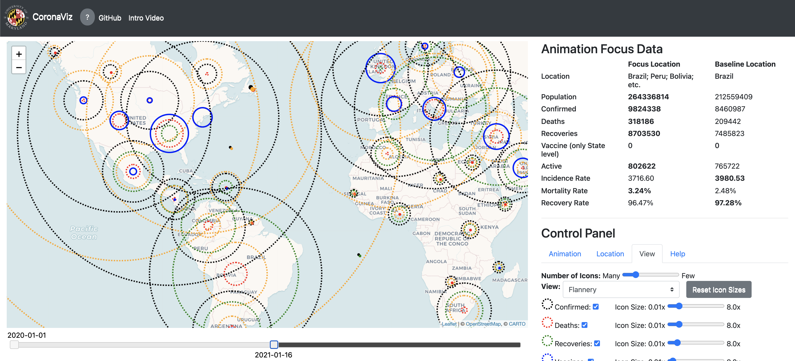

# CoronaViz

While many dashboards are available for visualizing COVID-19 data, most separate geospatial and temporal data into
discrete visualizations or tables. Further, the common use of choropleth maps or space-filling map overlays supports only a single
geospatial variable at a time, making it difficult to compare the temporal and geospatial trends of multiple, potentially interacting
variables, such as active cases, deaths, and vaccinations. Here, we present CoronaViz, a COVID-19 visualization system that
conveys multilayer, spatiotemporal data in a single, interactive display. CoronaViz encodes variables with concentric, hollow circles,
termed geocircles, allowing multiple variables via color encoding and avoiding the occlusion problems common to many COVID-19
visualizations. The radii of geocircles relate to the values of the variables they represent via the psychophysically determined Flannery
formula. The time dimension of spatiotemporal variables is encoded with sequential rendering. Animation controls allow the user to
seek through time manually or to view the pandemic unfolding in accelerated time. An adjustable time window allows data to be
aggregated at any granularity, from single days up to cumulative values for the entire available date range.

\* This work was sponsored in part by the National Science Foundation under Grant IIS-1816889.
